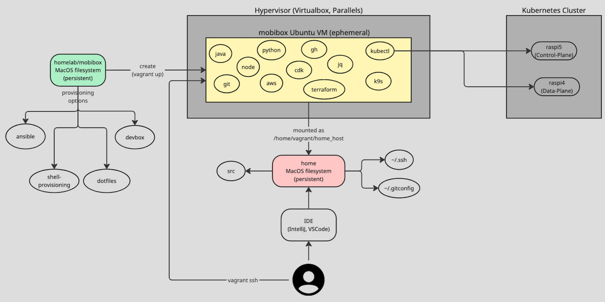

# mobibox Development Environment

I prefer to have a automated way of seeting up my development environment. This makes it much easier to change the development machine or start from scratch when something goes wrong. No need for a backup.

The files I work with (and configuration) remains on the host system to be able to destroy and recreate mobibox at any time. Therefore the home directory of my (MacOS) user on the host system is mounted into mobibox as `~/home_host`.

This way you have access to your host filesystem where you usually work with your IDE to write code. You can use mobibox to do the CLI stuff ... smooth integration into your daily work.



---

# Disclaimer

**BE AWARE:**

* this is an opinionated setup for **ME** ... it is not designed to be customizable via hooks. With some effort this would be possible but it is not needed for **MY** use-case and it would increase complexity. I've decided to not invest into that kind of comfort. Feel free to fork it.
* I use Virtualbox with `bento/ubuntu-24.04` in version `202502.21.0` for my daily work and sometimes Parallels on my Apple Silicon. The Ansible code should work on other hypervisors as well.
* the code (or only parts) might be broken - sometimes priorities are changing adhoc and I have no time to fix the issues (or I am even not aware of them - automated tests have no priority)

## Limitations - Virtualbox 7.1 on Apple Silicon with `bento/ubuntu-24.04` in version `202502.21.0`

* `vagrant halt && vagrant up` not working (see FAQ)
  * either use `vagrant suspend`
  * or recreate the machine
* `vagrant snapshot` not working (see FAQ)
* `apt upgrade` is freezing - see TODO-ref-2703127
  * same on Parallels ... looks like a problem of the Linux distribution
    * current workaround: no upgrade

**BE AWARE:** Virtualbox on Apple Silicon is quite new ... basic functionality is working fine

This setup is working but far from being optimal. The Parallels hypervisor on Apple Silicon is much more reliable.

## Limitations - Parallels on Apple Silicon with `bento/ubuntu-24.04` in version `202502.21.0`

* `vagrant halt && vagrant up` is failing - see Question 5 below
* `apt upgrade` is freezing - see TODO-ref-2703127
  * same on Virtualbox ... looks like a problem of the Linux distribution
    * current workaround: no upgrade

---

# Getting started in < 10 minutes

* clone this repo (e. g. `git clone https://github.com/mobi3006/homelab`)
* install a hypervisor
  * currently only Virtualbox is supported
    * it is no big deal to support others ... you only have to adjust the `Vagrantfile`
* install `vagrant` (e. g. `brew install vagrant`)
* optional: set those environment variables in your shell that is executing `vagrant up` afterwards

  ```
  export MOBIBOX_VM_NAME=my-mobibox
  export MOBIBOX_VM_MEMORY=2048
  export MOBIBOX_VM_CPUS=4
  export MOBIBOX_CPUTYPE=amd64
  ```

## Integration of Host system

mobibox is trying to provide a seamless integration with the host system for best developer experience (less redundancy, less configuration). As a result it will integrate

* some host filesystems (e. g. home folder)
  * you use the IDE and other tools on your host-system
* git configuration of the host system (`~/.gitconfig`, `~/.gitignore`)

This way you mobibox is offering a better shell with separated and fully prepared tooling. The intention is similar to Python's virtual environments or devbox. Your hostsystem should not be polluted with tons of packages that you only use once (e. g. experiments). On top of that the development environment should be available within minutes on any machine.

---

# Vagrant

Vagrant is a great way for automating the creation of a Virtual VM running in Hypervisors like Virtualbox, Parallels, ...

For mobibox there are 3 provisioning tools used

* ansible (`for the core provisioning done via `Vagrantfile` and integrated into shell initialization via `.profile`
* shell provisioning
* dotfiles provisioning
* devbox global provisioning with 

The reason for those different approaches is historical. Besides Ansible I started with shell provisioning. After some time I switched to dotfiles because of some benefits and in 2025 I found devbox to be a much better tool for development tooling setup. I keep those approaches in parallel to show the differences.

## Ansible Provisioning

For the core setup of mobibox I use Ansible. There are 2 phases:

* **phase 1:** to bring up a base mobibox
  * during initial `vagrant up`
* **phase 2:** to add packages/configuration that need user interaction (e. g. cloning GitHub repos that require authentication)
  * during initial `vagrant ssh`

When both phases have been executed the is a `/home/vagrant/.mobibox_fully_provisioned` file that prevents those phases to be executed again. You can enforce re-execution by

* **phase 1:**
  * `vagrant provision`
    * limited to specific changes (e. g. you cannot change the memory settings or the mounted filesystems)
* **phase 2:**
  * delete `/home/vagrant/.mobibox_fully_provisioned` and execute `vagrant ssh` again

This is mainly used to apply changes in Ansible provisioning, e. g. to test Ansible code. In general you should prefer to recreate the machine by `vagrant destroy -f && vagrant up && vagrant ssh`. mobibox is made for recreation at any time ... your working code is usually residing on the host system that remains untouched when `vagrant destroy`.

The core Ansible part (used during initial `vagrant up` and `vagrant ssh` - phase 1 + 2) should be as small as possible because it is user-specific which tools to install and which configuration to use. When I want to integrate my personal custom extensions via Ansible I use phase 3 that is integrated

## Challenges

It is quite hard to define a tooling that is platform-independent and working for several hypervisors.

One example is support for symbolic links. On Linux/MacOS you have support and tweaking the filesystem in a way that mobibox is configured is easy by using symbolic links. Parallels and Virtualbox can handle that and inside the mobibox the links are resolved correctly. But if you have a Windows-Host without symbolic-link support in combination with Hyper-V than the tweaking with links is not working because the links a simulated by a copy.

> **DECISION:** mobibox is designed to work on MacOS (with symbolic-link support) on Virtualbox and Parallels. This is the setup I use.

---

# Dotfiles

> this was replaced by devbox - see below

When Ansible is to heavy-weight to do some small provisioning changes which are still under test, I use shell-script based extensions of mobibox. Those scripts/extensions reside outside the mobibox on the host system - this way they survive mobibox recreation.

> I was inspired by [holman/dotfiles](https://github.com/holman/dotfiles)

My custom `dotfiles` extensions are integrated into mobibox via filesystem mount from `~/mobibox-contribs` (on host system) to `/home/vagrant/home_host/src/.dotfiles`. dotfiles are installed by alias `dotfiles-install`.

Check [dotfiles section within mobibox](./dotfiles/README.md)

---

# Devbox

[](https://www.jetify.com/devbox/docs/contributor-quickstart/)

[devbox](https://www.jetify.com/docs/devbox) is a package manager that is based on `devbox.json` and `devbox.lock` to configure packages on your system. This way your microservice can provide such metadata and with `devbox shell` you get all the packages installed that you need to work with that microservice ... it configures a virtual environment - isolated from tools that are installed on your system and from other microservices using the same tools but with different versions.

It is based on [nix](https://nixos.org/) that offers over [100.000 packages](https://search.nixos.org/packages).

## Benefits compared to OS-package manager

I am usually using Ubuntu LTS versions which might not provide the latest versions for all tools. Sometimes I have to add repositories for some tools. With devbox I usually get the latest versions.

I can also test/configure different versions of a tool ... with the OS-package manager this is almost impossible.

devbox is platform independent. I can use it on Linux, MacOS and Windows without any differences. This has great benefits for automating a development environment setup ... even in case you do not use a virtual machine like mobibox. I could use the devbox package configuration on any host-system out-of-the box.

## Global devbox packages

With the [global devbox configuration](https://www.jetify.com/docs/devbox/devbox_global/) you can replace other package manager like `homebrew` (MacOS) and `apt` (Ubuntu).

mobibox is using this approach for system-wide tooling that is not component specific.

## GitHub Actions support

* [github action support](https://www.jetify.com/docs/devbox/continuous_integration/github_action/)

---

# FAQ

## Question 1: reboot failing

On Virtualbox 7.1.x ("bento/ubuntu-24.04" in version "202502.21.0") on Apple Silicon `vagrant halt && vagrant up` is failing with

```
Vagrant was unable to mount VirtualBox shared folders. This is usually
because the filesystem "vboxsf" is not available. This filesystem is
made available via the VirtualBox Guest Additions and kernel module.
Please verify that these guest additions are properly installed in the
guest. This is not a bug in Vagrant and is usually caused by a faulty
Vagrant box. For context, the command attempted was:

mount -t vboxsf -o uid=1000,gid=1000,_netdev vagrant /vagrant

The error output from the command was:

/sbin/mount.vboxsf: mounting failed with the error: No such device
```

This prevents me from

* rebooting to use latest kernel installed during `sudo apt update && sudo apt upgrade`
* restoring snapshots by `vagrant snapshot restore SNAPSHOT_NAME`
  * creating snapshots by `VBoxManage snapshot "mobibox" take "initial" --live` is resulting in an ERROR and aborting the machine

Also the non-vagrant way

* from within mobibox by `sudo shutdown -h 0`
* starting via Virtualbox-UI

is not working. The reboot is working but mounted host filesystems are not recreated.

## Question 2: reboot failing - destroy failing

When situation of "Question 1" is happening a `vagrant destroy` is not working as well and I cannot delete the VM manually via UI.

### Solution 2a

* reboot the system
* delete the VM via UI or via `vagrant destroy`

## Question 3: restore snapshot not working

Restoring snapshots by `vagrant snapshot restore SNAPSHOT_NAME` reboots the machine and due to Question 1 this is failing. At the moment snapshot cannot be used with Virtualbox on Apple Silicon.

## Question 4: How to destroy mobibox?

### Solution 4a

* `cd mobibox`
* `vagrant destroy -f`
* `rm -rf .vagrant`

In some cases you might have to reboot the system to destroy mobibox (see question 2).

## Question 5: vagrant halt && vagrant up failing

... on Parallels with

> unknown filesystem type 'prl_fs'

### Workaround 5a:

Do not use `vagrant halt` ... use `vagrant suspend`.

## Question 6: apt upgrade failing with bento/ubuntu-24.04

It suddenly happened that `apt upgrade` is freezing on both Virtualbox and Parallels with the bento/ubuntu-24.04 box. This happens around the openssh-server package.

### Workaround 6a:

I've disabled the upgrade :-(

### Solution 6b:

I've exeuted the `sudo apt upgrade` manually and it resulted in a interactive popup that the `/etc/ssh/sshd_config` file is modified and I have to choose between keeping the old file or using the new one. I chose to keep the old file and the upgrade was successful.

